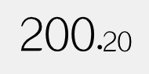

# awtk-widget-number-label

number_label 控件。用于显示数值的文本控件。
 
*. 可以通过指定属性 format 来改变小数的有效位数。

*. 可以通过指定属性 decimal\_font\_size\_scale 来减小小数部分的字体大小，以强调整数部分的重要性。



## 准备

1. 获取 awtk 并编译

```
git clone https://github.com/zlgopen/awtk.git
cd awtk; scons; cd -
```

2. 获取 awtk-widget-number-label

```
git clone https://github.com/zlgopen/awtk-widget-number-label.git
cd awtk-widget-number-label
```

## 运行

1. 生成示例代码的资源

```
python scripts/update_res.py all
```
> 也可以使用 Designer 打开项目，之后点击 “打包” 按钮进行生成；
> 如果资源发生修改，则需要重新生成资源。

如果 PIL 没有安装，执行上述脚本可能会出现如下错误：
```cmd
Traceback (most recent call last):
...
ModuleNotFoundError: No module named 'PIL'
```
请用 pip 安装：
```cmd
pip install Pillow
```

2. 编译

* 编译 PC 版本

```
scons
```

* 编译 LINUX FB 版本

```
scons LINUX_FB=true
```

> 完整编译选项请参考 [编译选项](https://github.com/zlgopen/awtk-widget-generator/blob/master/docs/build_options.md)

3. 运行

```
./bin/demo
```

## 文档

[完善自定义控件](https://github.com/zlgopen/awtk-widget-generator/blob/master/docs/improve_generated_widget.md)

## 注意事项

> 当 readonly 属性不为 true 时，可以用方向键修改控件的值。如果你使用方向键切换焦点，会存在焦点进入本控件后无法出来的问题。为了避免这个问题，可以采用以下几种措施之一：

* readonly 设置为 true
* 把按键事件重新映射。请参考 [键值映射](https://github.com/zlgopen/awtk/blob/master/docs/map_key.md)。
* 使用极简键盘。请参考 [支持极简键盘](https://github.com/zlgopen/awtk/blob/master/docs/how_to_support_5keys_3keys.md)。
